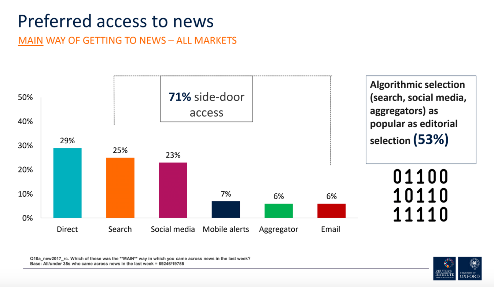
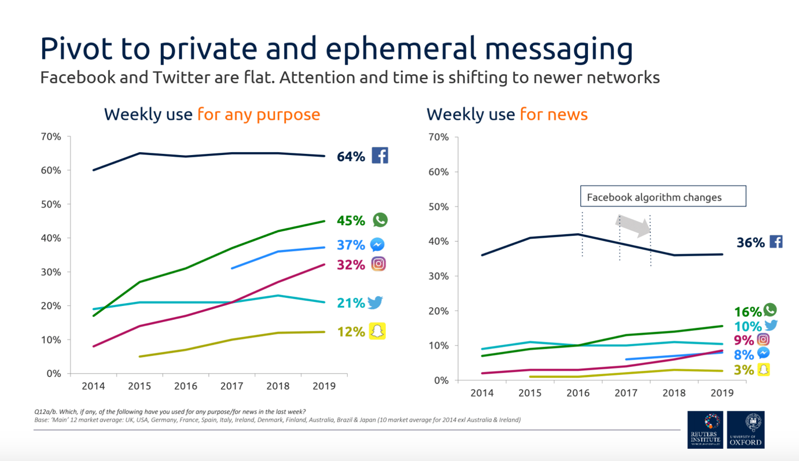
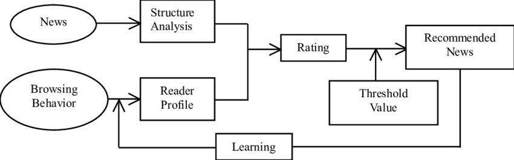
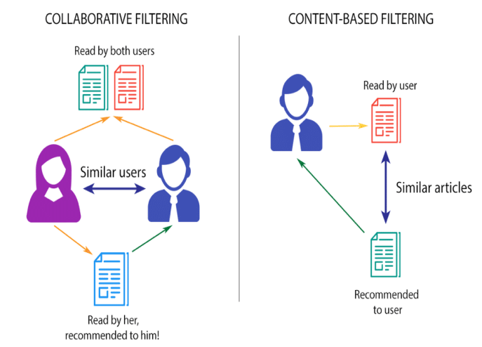
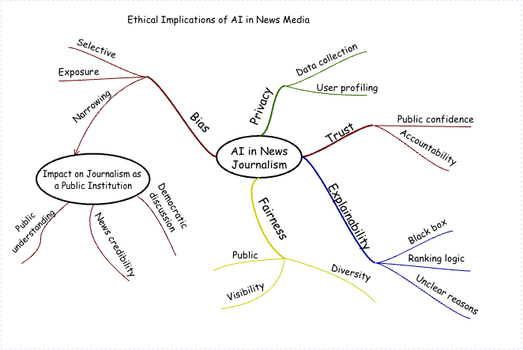
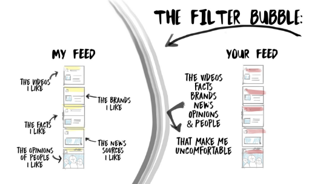
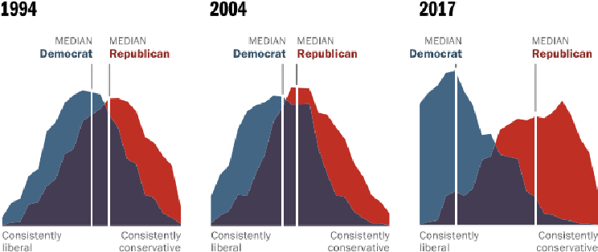

## Why News Media Turned to AI

The news media industry has long been responsible for informing the public, explaining events, and organising public discussion. In the past, news distribution depended mainly on editorial judgement and fixed page layouts. Media organisations decided which issues deserved prominence and which stories should appear on the front page, and readers encountered news in a relatively limited information environment. This pattern changed with the rise of digital platforms. News no longer reaches audiences only through newspaper front pages or television schedules. It now appears on personal screens through news apps, social media platforms, and content platforms.

*Figure 1. Preferred access to news across markets, highlighting the dominance of algorithmic and side-door access. (Fletcher, 2020)*

As the supply of content continues to grow, the central problem for the news industry is no longer only how to produce news. It is also how to distribute it effectively within a vast information environment so that users can actually see content that is relevant to them. Existing research suggests that the rise of algorithmic recommendation is closely linked to data expansion and information overload. By building user models that predict preferences, it helps content reach likely audiences more quickly, so it is often treated as a practical response to information explosion. This issue remains highly relevant rather than merely historical. Ofcom’s 2025 UK data shows that online news consumption is now on a par with television news, and that 51% of UK adults use social media as a source of news. This suggests that platform mediated and algorithmically shaped access to news is now a mainstream condition of news consumption rather than a marginal trend. It also helps explain why the algorithmisation and platformisation of news should still be treated as a current and timely issue rather than as an earlier phase of digital transition. (Ofcom, 2025)

In this field, the most visible challenge is information overload. Every day, large amounts of news, comments, short videos, images, and text are produced and published, and ordinary users cannot actively browse everything. When content becomes excessive, user attention becomes the scarcest resource. Traditional editorial distribution stresses news value and public significance, yet it is increasingly unable to meet the demands of the platform era in terms of speed, scale, and individual relevance. Researchers have pointed out that intelligent distribution has become a central logic of platform communication. It is data based and algorithm centred. By analysing user behaviour, it builds interest profiles and pushes content that is more likely to match specific users. For platforms, this mechanism improves both content reach and user retention. For users, it reduces the cost of selection and makes access to content more convenient.

Another challenge is that the goal of news distribution itself has changed. In the past, news media placed greater emphasis on public value, accuracy, and gatekeeping. Platform based communication places greater weight on clicks, viewing time, and interaction. As a result, the industry faces not only excessive content, but also a growing tension between distribution logic and news values. Existing studies note that algorithmic recommendation completes distribution through a black box process that is not visible to users. At the same time, platforms often rank content according to indicators such as overall popularity, collaborative filtering, and user preference. This is highly efficient in technical terms, but it also means that whether news is seen depends more and more on how models interpret users rather than simply on how editors judge public value.

A further challenge is that audience demand has become more fragmented and individualised. Digital news users are not a uniform group. People of different ages, professions, interests, and media habits want different kinds of content. The traditional one to many model finds it difficult to respond to such differences. By contrast, algorithm driven intelligent distribution is better able to address individual variation. The platform cases discussed in research may come from music, short video, and ecommerce rather than from news, yet their common logic is clear. Platforms build profiles from behavioural and identity data, match content to those profiles, and provide users with products or information that are most likely to meet their needs. This shows that personalised recommendation is not unique to journalism, but part of a wider mechanism of digital platform communication. News media need to adopt AI and ML because they must handle large volumes of content, understand user preferences, and improve communication efficiency within the same competitive platform environment.

*Figure 2. The shift in news consumption towards diverse social networks and the impact of platform algorithm changes. (Fletcher, 2020)*

For this reason, there is a clear practical case for using AI and ML in the news media sector. Recommendation models help platforms filter content quickly within large information systems and connect limited user attention with more relevant information. Related studies describe this process as content matching based on popularity, collaborative filtering, and user preference. Intelligent distribution can also improve the circulation of long tail content. Under traditional models, a small number of highly popular topics are more likely to dominate exposure, while niche but valuable content is often overlooked. Intelligent recommendation may allow less visible issues to reach their own audiences. AI can also improve the operational efficiency of news platforms. It supports not only ranking and recommendation, but also news production and management, which increases processing speed and scale. Research on AI in news communication suggests that big data and intelligent algorithms can select content that users are likely to find interesting on the basis of their characteristics and behaviour, and this improves the efficiency of information production, management, and distribution. In this communication environment, AI is no longer only a supporting tool. It is becoming a key mechanism that shapes how news is ranked, distributed, and seen.

## How AI Technologies Reshape News Production and Distribution

In the news industry, artificial intelligence is not used in only one way. It operates across several stages of the news process. Different technologies respond to different pressures. Some are used to sort and rank large volumes of content. Some help produce routine reports more quickly. Others support the handling of audio and visual material, which now makes up a large part of digital news. This matters because the main problems of contemporary news do not exist in only one area. News organisations must respond to information overload, rapid production cycles, fragmented audiences, and the growing importance of multimedia content at the same time. For this reason, the role of AI in journalism should be understood through a set of related technologies rather than through recommendation alone.

One major technology in this area is the recommendation system. A recommendation system is a model based mechanism that uses user data and content features to predict what a user is more likely to read, watch, or engage with. It helps a platform decide which items should appear first and which items should appear lower down in the feed. In practice, this is one of the clearest responses to information overload. News platforms publish and host very large amounts of material every day, and users do not have the time to search through everything for themselves. If all content were presented in the same way, much of it would remain unseen and users would face a confusing stream of choices. Recommendation systems reduce this problem by ranking content according to likely relevance.

*Figure 3. The architecture of a content-based news recommendation system, illustrating the continuous learning loop between reader behaviour and algorithmic rating. (Liang and Lai, 2002)*

These systems usually combine several signals. One common signal is popularity, which gives greater visibility to content that is already attracting wider attention. Another is collaborative filtering, which predicts a user’s interests by examining the behaviour of similar users. A third is content based preference modelling, where the platform learns from the topics, formats, and stories that a user has previously consumed. When these signals are brought together, the system can produce a personalised order of visibility. In the news sector, this helps platforms deliver material to users more efficiently and on a much larger scale than traditional manual curation alone. It also matches the reality of mobile news use, where people often read in short and fragmented moments rather than in long and planned sessions.

*Figure 4. The mechanisms of collaborative filtering and content-based filtering in news recommendation systems. (Mohamed et al., 2019)*

Still, recommendation does not fully explain how content reaches users. This is where intelligent distribution becomes important. Intelligent distribution refers to the broader platform process through which data are collected, audience profiles are updated, and content is delivered to different groups under different conditions. In simple terms, recommendation is the predictive core, while intelligent distribution is the wider delivery system around it. It draws on browsing history, reading duration, click patterns, device context, and other behavioural signals to decide not only what should be shown, but also when it should be shown and to whom.

This wider process matters because news audiences are highly diverse. Some users mainly follow international affairs, while others care more about local services, sports, or short form visual updates. A single front page cannot respond equally well to all of these needs. Intelligent distribution allows news organisations and platforms to send different content to different users without requiring the same content order for everyone. This can improve reach and user retention, and it can also help niche topics find relevant readers. At the same time, personalisation may narrow what users encounter. Pariser described this as a filter bubble, where algorithms shape a private information environment on the basis of past behaviour (Pariser, 2011). His example was that different users searching “BP” could receive very different results, from the oil spill to investment related updates. In the news context, this shows that algorithmic selection does not only improve relevance. It can also limit exposure to other issues and perspectives.

News production and distribution also involve more than ranking and delivery. Another important branch is natural language processing, or NLP, which allows machines to analyse, classify, summarise, and generate language. In journalism, one clear use is automated writing, especially in finance, sports, weather, and election updates, where information is already structured as data. A system can turn such inputs into short reports within seconds, which helps news organisations handle repetitive reporting in a faster and more consistent way.

The value of NLP does not stop at automated writing. It is also widely used for text classification, topic tagging, headline suggestion, article clustering, and summarisation. These applications respond to a different challenge from the one addressed by recommendation systems. The main issue here is not only how to distribute content, but also how to manage and process very large flows of text inside the newsroom. Journalists and editors must monitor reports from agencies, government statements, live updates, and public reactions across multiple channels. NLP tools can help organise this material by grouping similar stories, extracting key information, and producing short summaries that make review more efficient. In this sense, NLP supports both production efficiency and editorial workflow.

Speech recognition is another important technology that deserves attention in the news domain. Speech recognition converts spoken language into written text. This is highly relevant because a large amount of journalistic material begins in audio form. Interviews, press conferences, podcasts, speeches, and live broadcasts all produce speech that must often be turned into text before it can be edited, checked, quoted, or archived. Manual transcription takes time and labour. AI based speech recognition can reduce this burden and speed up the movement from a live event to a published report.

This is especially useful in breaking news settings. When a major event takes place, reporters and editors need to process spoken information quickly. Automatic transcription can help newsrooms generate searchable records of what was said, identify key statements, and support faster article drafting. It can also improve accessibility. Subtitles and transcripts make audio and video news easier to use for wider audiences, including people who prefer reading and those who cannot access spoken content directly. In multilingual settings, speech technology can also support speech translation. This can help journalists follow foreign language interviews or official statements more efficiently, and it can widen access to international material that would otherwise take longer to process.

Computer vision is also becoming important in digital journalism. Computer vision refers to techniques that allow machines to detect and interpret information from images and video. In the news sector, this matters because visual content is no longer secondary. News now circulates through photos, clips, livestreams, screenshots, and short videos across apps and social platforms. As a result, journalists need tools that can help them search, sort, and analyse visual material at scale.

One practical use of computer vision is content tagging and retrieval. Image recognition models can identify objects, faces, scenes, and visual patterns, which makes large archives easier to search. A newsroom with thousands of photos or video clips can use such tools to find relevant material more quickly. Computer vision can also support moderation and verification workflows. It can flag violent imagery, detect duplicated or altered visuals, and help trace whether a piece of content has appeared before in another context. This does not mean that machine vision can replace editorial judgement. It means that it can support faster screening and prioritisation when visual information spreads too quickly for manual review alone.

This point is especially important in an environment shaped by social media and user generated content. News organisations now often work with material that they did not produce themselves. Images and videos may arrive from witnesses, online users, or other platforms before a reporter reaches the scene. In these conditions, the challenge is not simply to publish quickly. It is also to assess authenticity and relevance under time pressure. Computer vision tools can help by identifying obvious inconsistencies and by narrowing the set of items that require closer human checking. Their value lies in support rather than full automation.

Even where AI improves speed and scale, it does not remove the need for human judgement. Automated writing works best with structured data. Speech recognition can still make errors when audio quality is poor or when speakers use unfamiliar accents. Computer vision can assist screening, but it cannot take over final verification. The practical value of these systems lies in support. They help journalists process routine and large scale material, while reporters and editors remain responsible for interpretation, verification, and editorial judgement.

## Privacy, Bias, and Trust: The Ethical Cost of AI-Driven News

*Figure 5. Ethical Implications of AI in News Media*

Once artificial intelligence enters the news industry, the key issue is not only whether it improves efficiency, but also what costs come with that efficiency. The first two parts have shown that news platforms adopt AI and ML mainly to address practical problems such as information overload, limited distribution efficiency, and the growing fragmentation of audience demand. Recommendation systems, intelligent distribution, and automated production have clearly improved the speed of content matching and processing. What matters in this third part, however, is a further question. As news becomes more dependent on personalised recommendation and data driven distribution, how do these technologies reshape the ethical boundaries of journalism, and how do these ethical concerns in turn limit the use of AI in news settings.

This question matters especially in journalism because news is not only a content product. It is also a public information institution. It does not simply deliver information. It also helps the public understand events, organise discussion, and maintain basic trust in facts. For this reason, AI in journalism cannot be judged only by whether it is more efficient. Its legitimacy must also be assessed through privacy, bias, fairness, explainability, interpretability, and trust.

One major issue is privacy. Personalised recommendation can work only when platforms continue to collect and analyse user data. The more a platform knows about its users, the more it is likely to know about their clicking habits, viewing time, browsing paths, and patterns of interest. The problem, therefore, is not only whether platforms collect data. It is also whether users really know what has been collected, how these data are used, and whether they have the right to refuse or adjust this process. In the news context, this issue is especially sensitive because news consumption reflects not only entertainment interests, but also political tendencies, social positions, and concern for public issues. If recommendation efficiency depends on forms of data extraction that users can barely notice, then this convenience already comes with a clear imbalance of rights.

This imbalance appears in another way as well. Platforms do not only know what users have read. They can also turn these actions into further inferences about identity and tendency. If a person repeatedly reads news about migration, war, elections, or social welfare, the platform may gradually form judgements about that person’s ideology, emotional preference, or issue sensitivity. Users themselves may not define themselves so clearly, yet the platform may still use these inferences to optimise the next stage of distribution. As a result, privacy in news recommendation is no longer only a question of whether data leak outside the system. It is also a question of whether the platform is continuously modelling users’ public information lives without full understanding and consent.

In an industry centred on being informed, expressing views, and taking part in public life, this continuing inference deserves serious concern. It means that users are not facing a neutral information service. They are facing a system that keeps reshaping the world they see according to their own traces. In other words, what users lose is not only control over data. They may also lose part of their control over their own news environment. The more platforms rely on hidden and continuous data collection to improve personalised distribution, the more the use of AI in journalism is likely to be questioned because of privacy and agency.

A second issue is bias and the narrowing of vision. This problem should not be blamed entirely on technology, because users themselves already show a tendency towards selective exposure. Garrett’s research suggests that internet news users are more likely to encounter information that reinforces views they already hold. This means that the ethical risk of recommendation systems does not lie in creating preferences from nothing. It lies in the fact that they may keep amplifying preferences that users already have, so that people become less likely to encounter different views.

*Figure 6. A conceptual illustration of the filter bubble effect, demonstrating how algorithmic selection isolates users from challenging information. (Vins, 2018)*

At the same time, this risk should not be described too absolutely. Fletcher and Nielsen’s cross platform study shows that online news audiences are not necessarily more fragmented than offline audiences. For journalism, this suggests that filter bubbles are worth concern, but their extent still depends on platform design, methods of content ranking, and users’ own habits of information choice. (Garrett, 2009) (Fletcher and Nielsen, 2017)

In other words, the ethical problem is not that platforms simply control users in a one sided way. It is that platforms gradually narrow the visible world by amplifying existing tendencies. One click, one period of viewing time, or one share can be treated as a stable preference and then become the basis of the next round of recommendation. The bias formed in this way does not always appear as the direct promotion of an extreme political position. More often, it appears as repeated reinforcement of certain issues, continuous preference for certain emotional styles, or the systematic absence of different social experiences and interpretive frames. Users may not immediately realise that they are trapped in a narrow information environment, because most of what they see is real, relevant, and sometimes even high quality. The problem is precisely that this content becomes more and more similar, more and more consistent with existing judgement, and less and less likely to challenge prior understanding.

*Figure 7. Comparison of public political polarization in the U.S. over the past two decades. (Alatawi et al., 2021)*

For journalism, this narrowing is more serious than simply seeing less. The purpose of news is to help the public understand a complex reality, not only to help people remain more comfortably within views they already hold. At the level of application, this also means that the more AI in journalism relies on behavioural feedback to optimise distribution, the more likely it is to face ethical criticism for reinforcing bias and weakening open exposure.

If the first two issues mainly concern individual users, a further ethical issue concerns the function of journalism as a public institution. In the news industry, fairness does not only mean whether platforms treat every user equally. It also means whether content with public value can still receive the visibility it deserves. If algorithms mainly optimise click through rate, emotional reaction, and viewing time, then entertaining, stimulating, and commercial content is more likely to be amplified, while public affairs reporting, explanatory reporting, and in depth investigation may become less visible. The seriousness of this problem does not lie only in the fact that good content gets buried. It is serious because the social function of journalism has never been limited to satisfying immediate user interest. It also includes bringing important but not always attractive issues into public view. Once ranking standards revolve more and more around short term interaction, news value itself may quietly shift from importance to effectiveness.

The fairness discussed here is closer to fairness in public visibility. When a news platform gives front page space, recommendation slots, or push opportunities to some content, it also lowers the position of other content. If platforms continue to prioritise material that can trigger more immediate reaction, then reporting that requires background knowledge, patient reading, and delayed judgement will be placed at a systematic disadvantage. This affects not only what users see. It also gradually affects what news organisations think is worth doing. When media institutions become more aware of which headlines drive interaction and which forms of expression are more likely to spread, platform metrics may in turn shape the logic of news writing and topic selection.

For journalism, this change has a clear ethical meaning because it suggests that instrumental rationality may be replacing value rationality. News distribution should partly follow public interest and professional judgement, but in an algorithm led environment it becomes easier for it to follow traffic and calculability instead. For this reason, diversity should not be treated as an optional feature in recommendation systems. Resnick and others argue that recommendation systems can promote diverse exposure and help users encounter information from different positions and different types. For news platforms, this means that recommendation mechanisms should not ask only what is most relevant. They should also ask what content is necessary for users to understand the public world. (Resnick et al., 2013)

This point is crucial because news recommendation is different from ordinary product recommendation. If users do not click on a product, what is lost may only be a chance to consume it. If users do not encounter important public issues, the voices of different social groups, or reporting with stronger background over a long period of time, what is damaged is their ability to understand reality. A more responsible news recommendation system cannot work only around similarity and immediate interest. It should preserve some degree of difference and public value, so that users not only see content they already know and agree with, but also encounter information they would not search for on their own and that still deserves to be seen. In this sense, diversity in the news context is not an added value. It is part of fairness. Once an AI system fails to protect this diversity over time, its use in journalism is more likely to be questioned as harmful to the public interest.

Ethical concerns in journalism also appear in explainability, interpretability, transparency, and accountability. Recommendation systems do not simply deliver content mechanically to users. They also quietly decide which news items are more likely to be shown first, which are delayed, and which may never enter the user’s field of view. The problem is that users can usually see only the result, but cannot understand the process. They know that one story appeared, but they do not know why it appeared. They also know that other content never appeared, but they cannot easily judge whether this is because they had no interest in it or because the platform had already filtered it for them. On ordinary content platforms, this lack of transparency already raises concern. In journalism, the problem is more serious because news distribution directly affects how the public encounters facts, forms judgement, and takes part in discussion. For this reason, explainability and interpretability in the news context are not only technical properties. They are conditions for whether news applications can gain ethical legitimacy.

More specifically, this lack of explainability directly affects public trust in AI based news distribution and also makes the boundary of responsibility more unclear. Recommendation weights, ranking logic, and user profiles are often treated as commercial secrets, so the whole process naturally takes the form of a black box. This issue is no longer only an abstract ethical concern. At the regulatory level, the EU AI Act turns transparency into a concrete compliance issue. The European Commission states that the Act’s transparency rules will apply from 2 August 2026, and that certain AI generated content intended to inform the public on matters of public interest should be clearly identifiable. (European Commission, 2025) This means that explainability and transparency are becoming not only normative expectations, but also part of the institutional environment in which AI for news will operate.

Once a platform pushes false, biased, or harmful content, there is no simple answer to whether responsibility should lie with the platform, the media organisation, the algorithm designer, or the editor who uses the system. Your reference texts have already pointed out that opaque algorithm design and unclear responsibility directly weaken news truthfulness and public trust. For journalism, whether artificial intelligence is trustworthy depends not only on whether it improves efficiency, but also on whether it can be basically explained, openly questioned, and held accountable when errors occur. If the recommendation process remains difficult to understand and examine, users will struggle to judge whether the platform is helping them discover information or using behavioural data to keep shaping the visible world. In the same way, if media institutions themselves cannot clearly explain why some content was amplified and why some was pushed down, then their own sense of responsibility for the distribution process will also weaken, and the public will find it harder to sustain stable trust. From the angle of application, this means that the news industry cannot fully embrace a highly black box AI system without limits, because the credibility of journalism requires at least a minimum level of explainability, oversight, and accountability.

Beyond these dimensions, AI in journalism also raises a broader ethical issue, namely whether journalism can still maintain its normative role as a public institution. What most clearly separates news from general content platforms is that journalism does not only attract attention. It also carries responsibility for explaining events, connecting society, and maintaining an order of facts. Once personalised recommendation, automated ranking, and platform goals become deeply embedded in news distribution, news organisations face a more fundamental ethical question. Are they serving public understanding, or serving user stickiness. Are they organising public discussion, or maximising viewing time. This is not only a theoretical question. It directly affects the acceptable limits of AI use in journalism. Once a system is widely seen as weakening the public character of news, it becomes difficult for it to gain long term institutional acceptance, even if it is technically faster, more accurate, and more efficient.

## The Future of AI in News

This blog has argued that artificial intelligence is no longer a marginal tool in the news industry. It is becoming part of the basic structure through which news is produced, organised, and distributed. In a digital environment shaped by information overload, fragmented attention, and platform competition, this shift is understandable. Recommendation systems help rank large volumes of content. Natural language processing supports routine writing and text management. Speech recognition and computer vision also make it easier for news organisations to handle audio and visual material at speed. In this sense, AI offers a practical response to real pressures in contemporary journalism. It improves efficiency, extends reach, and helps news organisations work at a scale that manual processes alone can no longer support.

At the same time, the discussion in this blog has shown that technical usefulness does not resolve the wider question of value. News is not simply another content industry. It is also a public institution that helps people understand events, form judgements, and take part in social life. Because of this, the use of AI in journalism must be judged by more than speed and relevance. Personalised systems depend on continuous data collection, which raises concerns about privacy and user control. Ranking systems may reinforce existing preferences and reduce exposure to different views. They may also favour content that generates immediate reaction over reporting with stronger public value. This creates a serious tension between platform logic and journalistic responsibility. The problem becomes even more serious when recommendation and ranking operate through opaque processes that users, and even media organisations, cannot clearly explain.

For this reason, the central issue is not whether journalism should reject AI. A more useful question is what kind of AI the news industry should accept and under what conditions. The most convincing direction is not full automation, but a form of human machine collaboration in which AI supports processing and distribution while human actors remain responsible for judgement, explanation, and accountability. In the same way, future news systems should not optimise only for engagement. They should also protect diversity, transparency, and public interest. AI can strengthen journalism, but only when it remains connected to the social purpose of news rather than to efficiency alone. (Ofcom, 2025)

## References

- Alatawi, F., Cheng, L., Tahir, A. and Karami, M. et al. (2021) ‘A Survey on Echo Chambers on Social Media: Description, Detection and Mitigation’. arXiv. doi:10.48550/arXiv.2112.05084.

- European Commission (2025). AI Act. [online] European Commission. Available at: https://digital-strategy.ec.europa.eu/en/policies/regulatory-framework-ai.

- Fletcher, R. and Nielsen, R.K. (2017) ‘Are news audiences increasingly fragmented? A cross-national comparative analysis of cross-platform news audience fragmentation and duplication’, Journal of Communication, 67(4), pp. 476–498. doi: 10.1111/jcom.12315.

- Fletcher, R. (2020). The truth behind filter bubbles: Bursting some myths. [online] Reuters Institute for the Study of Journalism. Available at: https://reutersinstitute.politics.ox.ac.uk/news/truth-behind-filter-bubbles-bursting-some-myths.

- Garrett, R.K. (2009) ‘Echo chambers online?: Politically motivated selective exposure among Internet news users’, Journal of Computer-Mediated Communication, 14(2), pp. 265–285. doi: 10.1111/j.1083-6101.2009.01440.x.

- Liang, T.P. and Lai, H.J. (2002) ‘Discovering user interests from Web browsing behavior: An application to Internet news services’, in Proceedings of the 35th Annual Hawaii International Conference on System Sciences (HICSS 2002). doi:10.1109/HICSS.2002.994214.

- Mohamed, M.H., Khafagy, M. and Ibrahim, M.H. (2019) ‘Recommender Systems Challenges and Solutions Survey’, in 2019 International Conference on Innovative Trends in Computer Engineering (ITCE). Aswan, Egypt. doi:10.1109/ITCE.2019.8646645.

- Ofcom (2025). Media Nations. [online] Available at: https://www.ofcom.org.uk/siteassets/resources/documents/research-and-data/multi-sector/media-nations/2025/media-nations-2025-uk-report.pdf?v=401287.

- Ofcom (2025) Online Nation: Report 2025. London: Ofcom. Available at: https://www.ofcom.org.uk/siteassets/resources/documents/research-and-data/online-research/online-nation/2025/online-nations-report-2025.pdf?v=409837 (Accessed: 24 April 2026)

- Pariser, E. (2011). The Filter Bubble: What The Internet is Hiding From You. New York: Penguin Press.

- Resnick, P., Garrett, R.K., Kriplean, T., Munson, S.A. and Stroud, N.J. (2013) ‘Bursting your (filter) bubble: Strategies for promoting diverse exposure’, in Proceedings of the 2013 Conference on Computer Supported Cooperative Work Companion. New York: ACM, pp. 95–100. doi: 10.1145/2441955.2441981.

- Vins (2018). The Filter Bubble - Vincenzo Musumeci. [online] Vincenzo Musumeci. Available at: http://www.vincenzomusumeci.com/digital-economics/filter-bubble/
